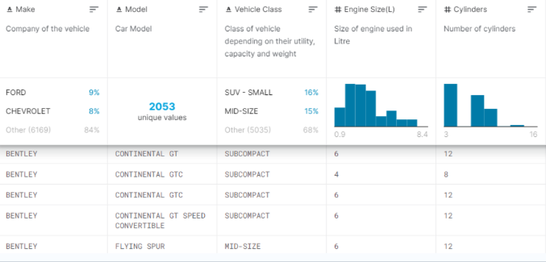
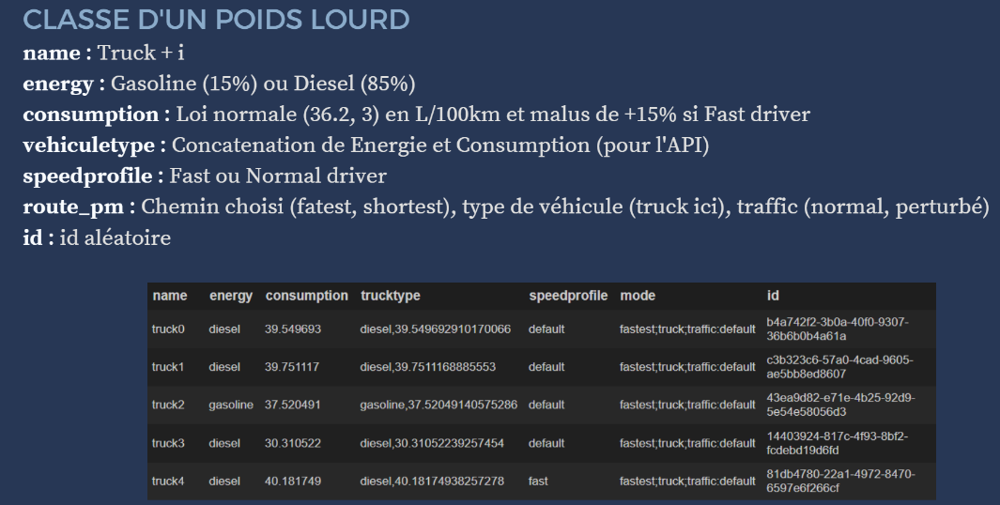
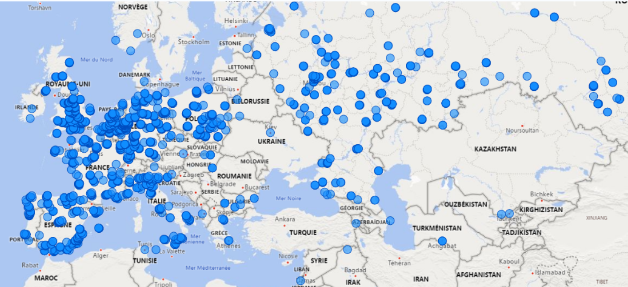

  

    <a ><strong>Car database</strong></a>
  

<!-- TABLE OF CONTENTS -->

  
Table of Contents

  <ol>
    <li>
      <a href="https://github.com/esnaultloic/CarDatabase/blob/master/ProjectBICars.pbix">Emission de CO2</a>
    </li>
    <li><a href="https://github.com/esnaultloic/CarDatabase/blob/master/create_truck.ipynb">Parc de poids lourds</a>
    <li><a href="#PoS">Points de vente</a></li>
    </li>
  </ol>

<!-- ABOUT THE PROJECT -->
## A propos du projet

Création d'une base de données de véhicules comprenant à la fois des poids lourds et des véhicules personnels avec pour objectif d'analyser la pollution du parc automobile fictif crée sur des trajets moyens.

(<a href="#top">back to top</a>)

### Outils utilisés

This section should list any major frameworks/libraries used to bootstrap your project. Leave any add-ons/plugins for the acknowledgements section. Here are a few examples.

* [PowerBI](https://powerbi.microsoft.com/fr-fr/)
* [Python](https://python.org)

(<a href="#top">back to top</a>)

### Emission de CO2

La première partie étape était d'analyser l'emission de CO2 de différents véhicules personnels à l'aide de Power BI.

Pour cela nous avons une base de données de véhicules avec différentes caractéristiques :

La taille du moteur, la classe du véhicule, le nombre de cylindrés, le type de carburant et l'emission de CO2

Nous avons d'abord le CO2 en fonction du nombre de cylindré :

Le CO2 en fonction du type de carburant :

Le CO2 en fonction de la classe de véhicule :

### Parc de poids lourds

Création d'une base de données de poids lourds ayant différentes caractéristiques : 
- le carburant utilisé (avec 15% de véhicules essence et 85% de véhicules diesel)
- la vitesse du conducteur
- le chemin choisi(le plus court ou le plus rapide)

L'emission de CO2 dépend d'une loi normale (36.2 L/100km) avec un malus de 15% pour les conducteurs "rapides".

### Points de ventes

Création d'une base de données d'enseignes alimentaires européennes grâce à GeoPy et représentation sur une map grâce à PowerBI :

